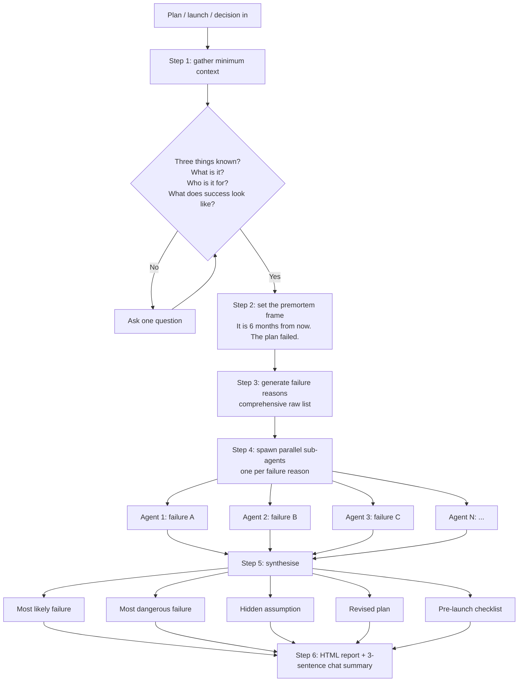

# premortem

A Claude Code skill that runs a premortem on any plan, launch, product, hire, strategy, or decision. Imagines the plan failed 6 months from now, works backward to find every reason why, then produces a revised plan with the blind spots exposed.

## The method

A premortem is the opposite of a postmortem. Instead of figuring out what went wrong after a failure, you imagine the failure has already happened and explain how, before you start.

- Method: Gary Klein, *Harvard Business Review*, 2007.
- Daniel Kahneman called it his single most valuable decision-making technique.
- Used by Google, Goldman Sachs, P&G.

The mechanism: "what could go wrong?" produces hedged, polite answers. "This already failed, explain why" puts the brain into narrative mode and generates specific, honest causes. Wharton and Cornell call this *prospective hindsight*.

This matters for AI assistance. Claude defaults to agreeable. Asking "is this a good plan?" gets reasons it's good. The premortem reframe forces honest failure analysis instead of polite risk assessment.

## How it works

Six steps. Linear flow. Parallel sub-agents do the heavy lifting in step 4.



Each sub-agent in step 4 takes one failure reason and writes the story of how it played out. Three things come back per agent: the failure narrative, the underlying assumption that made it possible, and 1–2 early warning signs the user can watch for.

## What it catches

Failure classes that polite risk assessment routinely misses:

- **Audience mismatch.** The plan targets people who don't actually buy, or don't self-identify the way the plan assumes.
- **Hidden friction.** Approval cycles, integration costs, prep time the user didn't budget.
- **Wrong-buyer drift.** Early customers or testimonials that pull the plan away from the intended target, compounding over time.
- **Tooling gaps.** Demo environments, infrastructure, content prep that takes longer than estimated.
- **Revenue / cost mismatch.** Max upside doesn't justify the prep effort against alternative uses of the time.
- **Foundational assumption.** The single thing the user takes for granted that the whole plan rests on. Often the real value of the premortem.

## When NOT to apply

- Vague ideas with no concrete plan yet. Help plan first, then premortem.
- Questions with one right answer. Just answer.
- Creative feedback on a draft. That's editing.
- Decisions already made and irreversible. A premortem only helps when course correction is possible.
- Multi-perspective decision support. Use a council or devil's-advocate flow instead. Different mechanism, different output.
- Simple feedback or factual questions.

## Output

A single self-contained HTML report saved to the workspace. Synthesis at the top, one card per failure reason below showing the story, the assumption, and the warning signs.

In the chat: a 3-sentence summary covering the most likely failure, the hidden assumption, and the single most important revision. The HTML has the full detail.

## Install

```
git clone https://github.com/b1rdmania/claude-premortem-skill.git ~/.claude/skills/premortem
```

(Adjust the URL if the repo name differs.)

## Trigger phrases

*premortem this, premortem my, what could kill this, stress test this plan, find the blind spots, poke holes in this, where will this break, am I missing anything, what could go wrong, future-proof this, devil's advocate this.*

## Sources

- Gary Klein, "Performing a Project Premortem," *Harvard Business Review* (2007).
- Daniel Kahneman, *Thinking, Fast and Slow* (2011) — chapter on prospective hindsight.
- Mitchell, Russo, Pennington, "Back to the future: temporal perspective in the explanation of events," *Journal of Behavioral Decision Making* (1989). The academic origin.

## License

MIT
